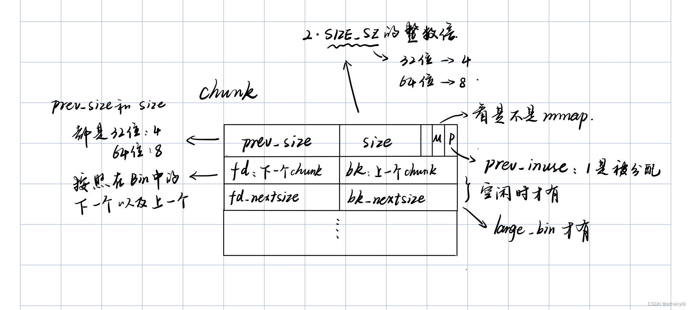

# Heap

# chunk结构



其中`prev_inuse`变量是用来检测**前一个`chunk`是否为空闲状态**

**如果这个堆的上一个堆是空闲的，那么首先**`prev_inuse`**变量会是0，然后`prev_size`变量会是上一个的值**

# tcache bin

## 2.26至2.31之前

[好好说话之Tcache Attack（1）：tcache基础与tcache poisoning-CSDN博客](https://hollk.blog.csdn.net/article/details/113400567)

tcache引入了两个新的结构体：`tcache_entry`和`tcache_perthread_struct`。

### `tcache_entry`

```c
typedef struct tcache_entry
{
  struct tcache_entry *next;
} tcache_entry;
```

### **关键点**

- **没有直接指向`chunk`的指针**：因为**`tcache_entry`**本身就在**`chunk`**的内存空间内，所以不需要一个显式的指针来连接**`tcache_entry`**和**`chunk`**。
- **隐式关联**：**`tcache_entry`**和它所代表的**`chunk`**通过它们在内存中的位置隐式关联。实际上，**`tcache_entry`**的地址就是**`chunk`**的地址。

这里用的hollk师傅的图


bin中的chunk的指向的是前一个chunk的data部分

### **tcache_perthread_struct**

```c
typedef struct tcache_perthread_struct
{
  char counts[TCACHE_MAX_BINS];
  tcache_entry *entries[TCACHE_MAX_BINS];
} tcache_perthread_struct;

# define TCACHE_MAX_BINS                64

static __thread tcache_perthread_struct *tcache = NULL;
```

tcache_perthread_struct是用来管理tcache链表的，这个结构体位于heap段的起始位置，size大小为0x251。每一个thread都会维护一个`tcache_perthread_struct`结构体，一共有`TCACHE_MAX_BINS`个计数器`TCACHE_MAX_BINS`项tcache_entry。

- tcache_entry 用单向链表的方式链接了相同大小的处于空闲状态（free 后）的 chunk
- counts 记录了 tcache_entry 链上空闲 chunk 的数目，每条链上最多可以有 7 个 chunk

注意：每条链上如果超过

以下图源于hollk师傅


以64位系统为例，假设从**`0x20`**开始，每个**`bin`**的大小递增可能是**`0x10`**（16字节）或其他特定值，具体取决于glibc的版本和配置。这意味着**`tcache`**的第一个**`bin`**会缓存大小为**`0x20`**（32字节）的**`chunk`**，第二个**`bin`**缓存**`0x30`**（48字节）的**`chunk`**，以此类推。 

## fastbin

fastbin中的chunk的fd指针指向的是前一个chunk的header部分

# 版本：

## libc2.32

### **Safe-linking(ptr xor)**

libc2.32中引入了Safe-linking机制，应用于fastbin和tcache中

在libc2.32以后，通过Safe-linking机制后的fd指针，存在这个位置的指针其实是以下计算的结果，其中p是真正的下一个chunk的地址，而L是存储这个指针的地址


举例来说：


要从0x390这里计算后一个chunk地址，也就是3b0地址，需要这样

```python
0x00005560becfeaa6 ^ (0x5565e89163a0 >> 12) = 0x5565e89163b0
```

# Fastbin Attack

[【堆知识总结 _ bins结构】fastbins attack：babyheap_0ctf_2017](%E3%80%90%E5%A0%86%E7%9F%A5%E8%AF%86%E6%80%BB%E7%BB%93%20_%20bins%E7%BB%93%E6%9E%84%E3%80%91fastbins%20attack%EF%BC%9Ababyheap_0ctf_2017%203ffa01987ceb456b84c4f4feb7b8f3b4.md)

fastbin的话构造的大小就不能大于`0x80`

fastbin attack分为比较的多的几种模式，像是包括Fastbin Dup（double free）等

### Fastbin Dup（double free）


如果我们可以构造成这种样子的fastbin，那我们在malloc了chunk1之后，可以更改chunk1中的fd指针，也就是可以手动让fastbin重新添加出一个chunk，变成如下图所示样子：


## House of spirit

House of spirit可以看成是fastbin dup的扩展，对于fastbin dup中是必须要用malloc的chunk来构造dup的情况，在House of spirit就是可以通过自己构造的方法，来构造出一个我们自己用的chunk，而不是通过malloc、calloc这种函数

fastbin中的构造条件：

- **fake chunk 的 ISMMAP 位不能为 1，因为 free 时，如果是 mmap 的 chunk，会单独处理**
- **fake chunk 地址需要对齐MALLOC_ALIGN_MASK**
- **fake chunk 的 size 大小需要满足对应的 fastbin 的需求，同时也得对齐**
- **fake chunk 的 next chunk 的大小不能小于 2 * SIZE_SZ，同时也不能大于av->system_mem**
- **fake chunk 对应的 fastbin 链表头部不能是该 fake chunk，即不能构成 double free 的情况**

# Off by One

off by one的溢出其实很常见，不论是在栈溢出还是在堆溢出中。这个溢出的利用其实包含很多，在堆中有的是**用来修改**，有的是**用来泄露。**

**用来修改时**，情况就是后面可以修改别的chunk，可以用这个溢出来进行chunk头的修改。

用来泄露时，那就是和printf等打印函数结合着用了，当他把我们字符串最后一个0字符覆盖之后，我们使用打印函数就可以泄露出我们想要用的值。

而在堆相关漏洞利用中，如果有把地址指针改变的地方。有可能就是想要把这个指针改到类似去`description` （类似）的地方，在这个地方进行伪造

## 例题：B00ks

这个题是使用了一个book的小图书系统，其中存在着一个off-by-one的漏洞

首先打开ida，经典的堆题模板


界面如下：


我们从add函数中可以看出


首先，这里申请的chunk在内存中顺序如下：

先是name的chunk、然后是description的chunk、再然后是一个结构体的chunk，这个结构体如下：

```c
struct bookStruct
{
  _DWORD id;
  void *name;
  void *des;
  _DWORD des_size;
};
```

这个结构体存在一个array的变量中，同时有一个指针指向这个数组，array_address即是这个变量


同时，我们看出author_name是指向202040，而array开头是202060，同时read函数还是这样的：


里面很明显有一个off_by_one了，我们可以知道本题中off-by-one的使用是靠array和author靠在一起这一点

有这个off_by_one之后，我们可以意识到：

- 我们可以通过先弄一个array，再改author，将array指向结构体的指针修改，末尾变为0
- 我们可以先弄一个author_name，再弄一个array，让其覆盖掉author_name的最后一位，这样当涉及到printf函数的时候就可以直接把struct的地址打印出来了

~~不过因为本题的方法在套用ASLR的时候是不可用的，所以我这里仅仅记录一下思路：~~

**mmap和libc的距离是不变的（起码在glibc2.31及其之前的版本中是这样的），不是套不套用ASLR的问题**


可以看出，它是用了第一种思路，将结构体指针进行修改，改向了指向description的地址，然后用这个des中构造了一个伪造的小book1

这个小book1中的name指向book2的name，des指向book2的des，这样就可以进行通过修改book2的name和des来进行**任意内存改写**

但是由于题目中是开启了PIE，所以是不能直接通过got表进行改写的，需要找一找有什么是和libc间隔固定的

# UAF

UAF其实是一个单说原理很简单的漏洞概念，但这个漏洞的利用其实我一直没有很弄懂，所以在这里归纳一下

UAF，也就是use after free，在对一个堆中的值进行free后，没有将指针清零导致漏洞

利用方式上，UAF的利用有很多，例题里面是通过悬空指针对原本已经被free的地址空间存在修改功能，能够指使被指的地址空间

> 当较小体积的chunk被free了之后，进入了fastbin中。在fastbin中，貌似是只有fd指针被变了，chunk其他位置如果有悬空指针的话，是不会被改变的
> 

他其实自身没有什么特别的，特别的都是要和其他的很多漏洞进行结合

## 例题：**hitcon-training-hacknote**

[好好说话之Use After Free-CSDN博客](https://hollk.blog.csdn.net/article/details/108797478)