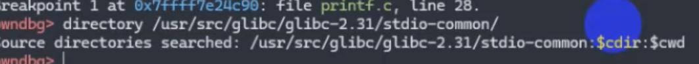

# gdb命令
只记录了少许我想记录的命令，具体全体指令集请去官方文档查看


```python
delete 1-10             # 删除断点
i register              # 展示register

strings ./libc-2.23.so | grep "GLIBC"  # 查找字符串

b *$ rebase(0x123456) //$rebase 在调试开PIE的程序的时候可以直接加上程序的随机地址
```

## 异结构pwn调试

异结构的pwn要进行调试需要进行远程调试

```python
qemu-mipsel -g 1234 -L ./ ./Mplogin
```

- g ：暴露调试端口
- L ：在程序寻找动态链接库的时候优先在此目录下寻找

在`gdbdbg`中：

```bash
gdb-multiarch ./pwn
set arch mips
set endian little
target remote :1234
c
```

## exp中如何调试

假设我们需要利用exp来调试程序，那么我们需要在exp.py中写入类似如下语句：

```python
p = process(["qemu-mipsel-static", "-g", "1234", '-L','/usr/mips-linux-gnu', "./pwn"])   
```
其中`qemu-mipsel`是指小端模式的mips结构

这将启动`qemu`模拟器并在端口 1234 上等待调试器连接，相当于是脚本在等待远程，当我们在gdb中使用指令：

```bash
gdb-multiarch ./pwn
set arch mips
set endian little
target remote :1234
```

就可以通过添加断点的形式来进行相关地址的运行以及调试

## 调试方法

方法一：

- 直接gdb，然后使用file命令进行加载程序
- 直接使用以下命令：
    
    ```bash
    gdb -ex "run" --args ./your_file <args ...>  
    ```
    
    
    

方法二：

- 直接启动程序，然后通过attach上进程开始调试
    
    ```bash
    gdb ./binary --pid $(pidof binary)
    ```
    

方法三：


## 基础使用

### 进程相关

- 退出进程
    - 使用kill命令，在gdb中退出，但是可以重新run
- 开启进程
    - 使用`start` 命令，gdb会断在`main`函数阶段，使用`starti`指令，gdb会断在最开始
- `procinfo`命令：打印信息
- `step`命令：执行一行源码，但是进入函数
- `next`命令：同上，不进入函数
- 想看源码：可以先下载源码，然后设置函数`dir`，将其加载
    
    
    
    - `list`命令：查看源码
- 断点：
    - 查看断点 `i b`
- `awatch *<addr>`
- `whatis`
- `reg`